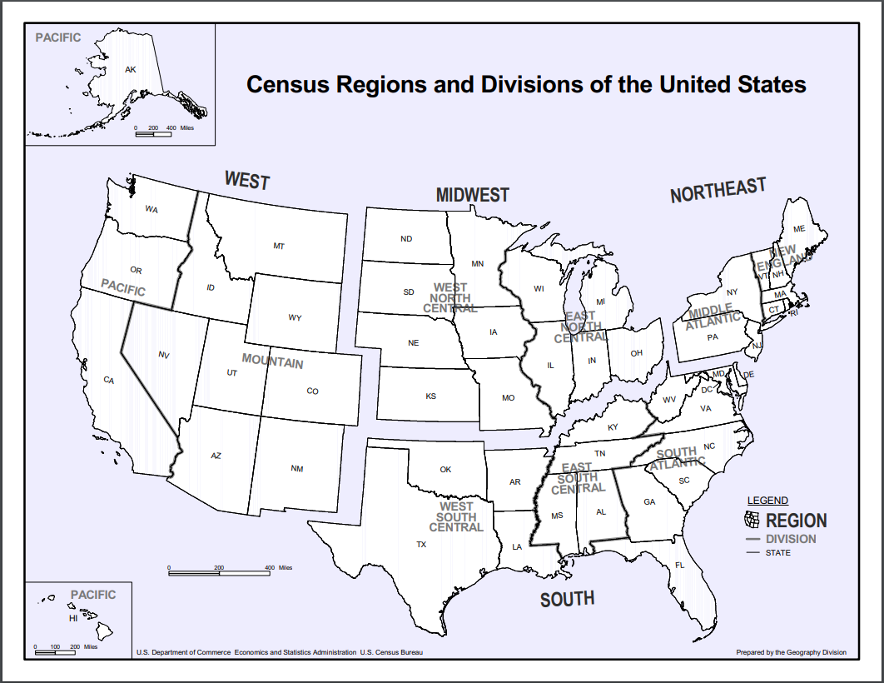

### Background

The data this week is on Americas history of slavery, and comes from several sources including the US Census Archives. Slavery was a legal institution until the passing of the Thirteenth Amendment in 1865. It took until June 19th, 1865 for Federal troops to arrive in Galveston, Texas to enforce the emancipation, and that say is now celebrated as *Juneteenth*. 

The data set TidyX is exploring is the data from the US Census from 1790 to 1870. It is important to remember that census used racial categories based on social usage, and recorded three denotations; Black designated as Free, Black designated as a Slave, and White.

## US Census Map Regions



```{r setup, include=FALSE}
knitr::opts_chunk$set(echo = FALSE, warning = FALSE, error = FALSE, message = FALSE)
suppressPackageStartupMessages({
  library(tidyverse)
  library(knitr)
  library(tidytuesdayR) #remotes::install_github("thebioengineer/tidytuesdayR")
  library(colortable) #remotes::install_github("thebioengineer/colortable@vctr_refactor")
})
```

```{r data}
quiet <- capture.output({
  tt <- tt_load("2020-06-16")
})

```

```{r populations, echo=FALSE}

population_percents <- tt$census %>%
  mutate(division = ifelse(region == "USA Total", "USA", division)) %>%
  filter(!is.na(division)) %>%
  mutate(
    
    total_c = as.character(total),
    
    `Percent Enslaved Black Population` = color_vctr(
      scales::percent(black_slaves / black, accuracy = 0.01),
      text_color = ifelse(black_slaves > 0, "red","blue")
    ),
    
    `Percent Population - Black` = scales::percent(black / total, accuracy = 0.01),
    `Percent Population - White` = scales::percent(white / total, accuracy = 0.01)
  ) %>%
  select(
    year,
    region,
    division,
    `Total Population` = total_c,
    `Percent Enslaved Black Population`,
    `Percent Population - Black`,
    `Percent Population - White`
  )

```

```{r make-tables-for-each-region, results = 'asis'}

unique(population_percents$region) %>%
  walk(function(reg) {
    
    cat(paste("\n##", reg, "\n"))
    
    population_percents %>%
      filter(region == reg) %>%
      distinct(division) %>%
      pull(division) %>%
      
      walk(function(div) {
        
        if (div != "USA") {
          cat(paste("\n###", div, "\n"))
        }
        
        population_percents %>%
          filter(division == div) %>%
          select(-division, -region) %>%
          arrange(year) %>%
          mutate(
              `Total Population` = scales::comma(as.numeric(`Total Population`))
          ) %>% 
          data.frame() %>%
          format() %>%
          set_names(
            c(
              "Year",
              "Total Population",
              "Percent Enslaved Black Population",
              "Percent Population - Black",
              "Percent Population - White"
            )
          ) %>%
          kable() %>%
          print
        
      })
  })

```

