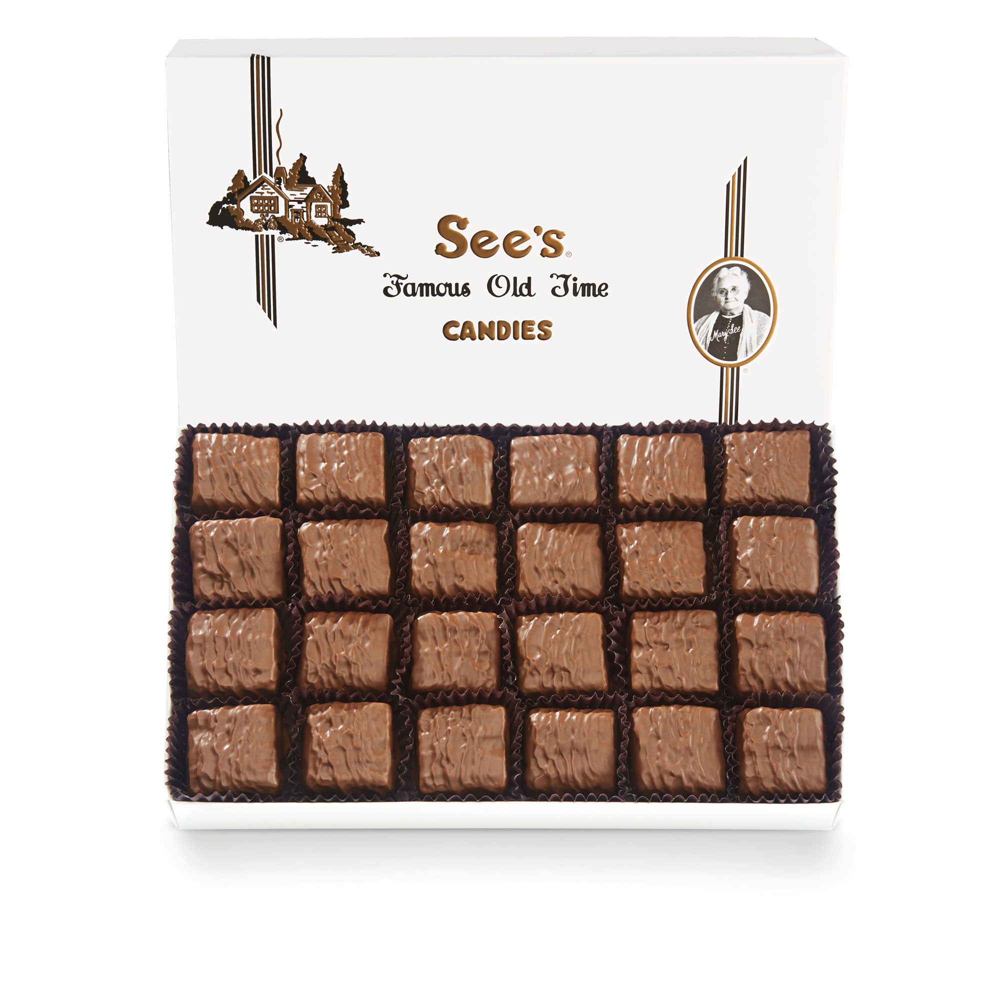
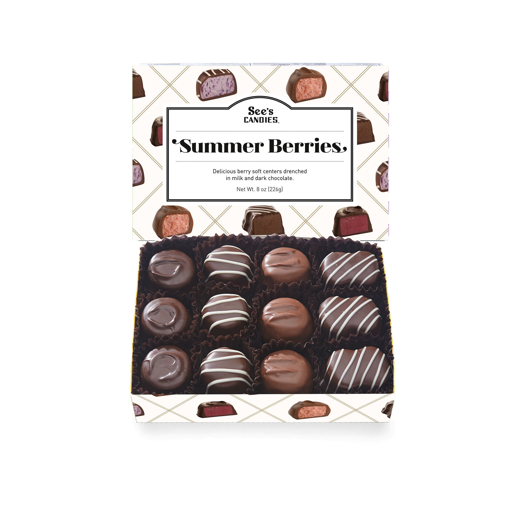
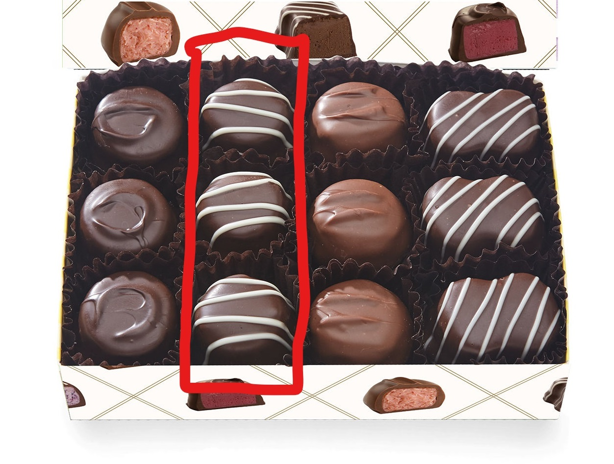

## R Objects

-   Rich Object system (Base, S3, S4, R6, RC, ...)

# Objects - what are they

-   Think of an object as a box

    -   individually it has its own size and has specific contents
    -   There are types of boxes with specific properties and behaviors

-   Object have properties known as "class"

    -   different box types

        -   can have different items
        -   speeds of delivery

```{r Objects, eval=FALSE}

TRUE #LOGICALS (BOOLEAN) - a true or false value

1 # INTEGER - A number with no decimals

1.1 # NUMERIC - A number with the ability to have decimals 

"HELLO WORLD" #CHARACTER (STRING) - words or numbers within quotes 

```

# Variable Assignment

-   Value assignment to variables is done through '\<-' '="

-   To continue the box metaphor

    -   Like writing "kitchen stuff" on a box
    -   you can change the name of the box, but the contents don't change

```{r ObjectsAssignment}
sampleObject <- TRUE #TRUE or FALSE
```

# Objects in Objects

### The next object level up are

-   Vectors, Matrices and Data.frames

    -   Stores multiple low level objects as one

-   Box Metaphor:

    -   More complicated boxes, that hold the smaller boxes within them

##Vector

-   Vectors hold other objects

    -   in a single Dimension

        -   think of a skinny box that can only hold a single line of boxes
        -   Sleeve of oreos

    -   Objects with in the vector are of the same type

    -   created with the 'c' function

```{r Objects_in_Objects_Vectors}

VECTORS_LOGICAL <- c(TRUE,TRUE,FALSE) 

VECTORS_NUMERIC <- c(1,2.5,3.14159267834)
VECTORS_NUMERIC_SEQUENCE <- 1:10

VECTORS_CHARACTER<-c("THIS","is","A","Character","Vector")
```

When you print a vector, it looks like this:

```{r Objects_in_Objects_Vectors_print}
VECTORS_CHARACTER
```

# Objects in Objects

**Matrix**

-   *All contents* must be of the same class
-   {width="300"}\

**Data.frame**

-   *columns* must be of the same class
-   {width="300"}

```{r Objects_in_Objects_Matrices}
MATRIX_LOGICAL<-matrix(c(TRUE,TRUE,FALSE,FALSE,TRUE,TRUE),ncol=2)

MATRIX_NUMERIC<-matrix(c(1,2,3,4,5,6,7,8,9),ncol=3)

DATA_FRAME_MIX <- data.frame(
  col1 = c(TRUE,TRUE,FALSE),
  col2 = c(132.4,56.7,89),
  col3 = c("THIS","IS A","DATA.FRAME!")
  )
```

# Objects in Objects

### Accessing Content

-   To access the data stored in these objects we use "square braces": [ ]

    -   inside the square brace we input a vector

    -   we can access a single entry or multiple

    -   Vectors

        -   One dimension, the entry number:

```{r vector_extraction}
VECTORS_LOGICAL[1]
VECTORS_LOGICAL[c(2,3,4)]
```

-   Matrices and data.frames

    -   Two dimensions; rows and columns

```{r matrix_extraction}
MATRIX_NUMERIC[1,1]
DATA_FRAME_MIX[1:2,]
DATA_FRAME_MIX[,1,2]
```

# Objects in Objects

### Changing/Assigning Content

-   Assign new values to elements of vectors, matrices and data.frames is done with "\<-"

    -   specify the element(s), rows, or columns you want to replace
    -   use the assignment '\<-' with the new values

-   You can replace a specific entry, or an area with a value

```{r assignment_specific}

MATRIX_NUMERIC[1,]<-45
MATRIX_NUMERIC[2,c(2,3)]<-c(20,40)

```

```{r assignment_print}
MATRIX_NUMERIC
```

# Objects in Objects

### Names

-   Vectors, Matrices and Data.frames can also have naming along each of their dimensions

    -   Allows for easier indexing

-   If each column of the chocolates box on the left had a name describing its contents

    -   "dark_round"
    -   "swirled_round"
    -   "light_round"
    -   "swirled_square"

{style="margin:auto, width: 100%" width="285"}

```{r, eval=FALSE}
chocolate_box[,c(2,4)]
chocolate_box[,c("swirled_round","swirled_square")]
chocolate_box$swirled_round
```
