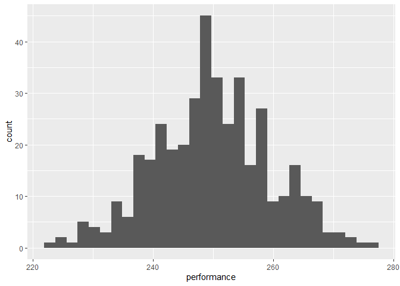
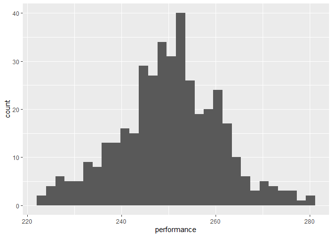
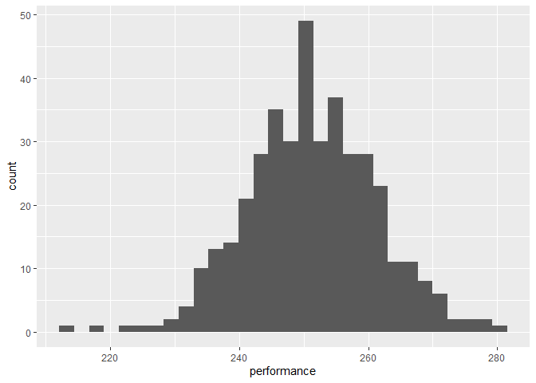

## {.tabset}


###  Bob 

This is some plot summarizing how  Bob  performs!

<!-- -->

###  Kam 

This is some plot summarizing how  Kam  performs!

<!-- -->

###  AJ 

This is some plot summarizing how  AJ  performs!

<!-- -->

## This is a new section

This is some text here! The tab section has ended. Display content that is to be rendered by markdown is "asis"


|player |     Mean|        SD|
|:------|--------:|---------:|
|AJ     | 251.1829| 10.033044|
|Bob    | 249.8248|  9.666088|
|Kam    | 250.2559| 10.756903|


```
## [1] 1 2 3 4
```


